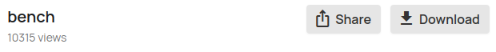

# StreamableDownloader
## A browser userscript to download videos hosted on Streamable

This userscript adds a *Download* button which enables you to download Streamable videos.

To set it up:
- Install on your browser a userscript manager such as the open source one **Violentmonkey** ([link on Chrome](https://chromewebstore.google.com/detail/violentmonkey/jinjaccalgkegednnccohejagnlnfdag?hl=fr), [link on Firefox](https://addons.mozilla.org/en-US/firefox/addon/violentmonkey/));
- Once it's done, open the script in your browser by clicking [here](https://raw.githubusercontent.com/Contrapunctus-XIV/StreamableDownloader/refs/heads/main/index.user.js);
- Click on "Install", and you're done!

## Example
